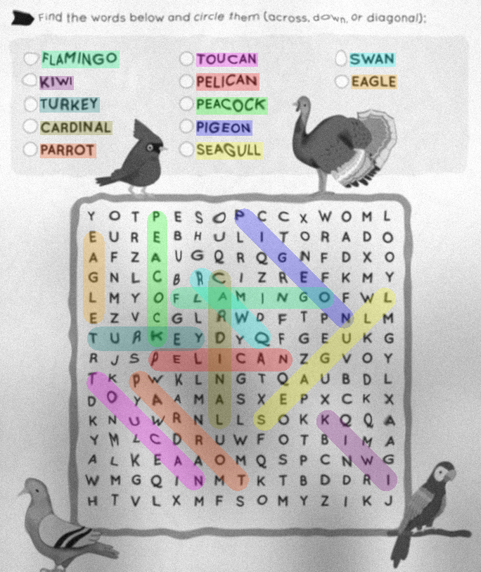

# WordSearch OCR & Solver

This project is a **WordSearch Solver** powered by a custom-built **Convolutional Neural Network (CNN)** for character recognition. 

## Overview

The project is divided into three main components:
1.  **Image Processing**: Preprocessing raw images to extract character cells.
2.  **Neural Network (OCR)**: A custom CNN architecture designed for high-accuracy character recognition (A-Z).
3.  **Probabilistic Solver**: An exhaustive search algorithm that handles OCR uncertainty using information theory.

---

## Example Result

The system processes a word search image and identifies both the grid and the words to find.

*Example of the input image being processed by the system.*

---

## Neural Network Architecture

Our CNN is built from scratch in C, emphasizing performance and architectural efficiency. It follows a modern design inspired by **ResNet** and **SqueezeNet**.

### Core Architecture
The network consists of three **Convolutional Blocks** followed by a **Classification Head**:

1.  **Block 1**: 28x28 input ➔ 64 channels ➔ 14x14 (MaxPool)
2.  **Block 2**: 14x14 input ➔ 128 channels ➔ 7x7 (MaxPool)
3.  **Block 3**: 7x7 input ➔ 256 channels ➔ 7x7
4.  **Classification Head**:
    *   **Global Average Pooling**: Reduces spatial dimensions to 1x1.
    *   **Fully Connected (256 ➔ 128)** with **SiLU** activation.
    *   **Dropout (25%)**: For regularization.
    *   **Fully Connected (128 ➔ 26)**: Outputting logits for each letter of the alphabet.

### Key Features
*   **SiLU (Sigmoid Linear Unit)**: A smooth, non-monotonic activation function ($x \cdot \sigma(x)$) that outperforms ReLU in deep architectures by preventing "dead neurons."
*   **Residual Connections**: "Shortcuts" that allow gradients to flow more easily through the network, mitigating the vanishing gradient problem.
*   **Contiguous Tensors**: All data is stored in flat, contiguous memory blocks, maximizing cache locality and allowing for efficient multi-dimensional indexing.
*   **Hardware Acceleration**: Optimized using **SIMD (AVX2)** intrinsics. A single instruction can process 8 floating-point numbers simultaneously, drastically speeding up convolution operations.

---

## The Solver: Probabilistic Template Matching

Unlike traditional solvers that only take the most likely letter (argmax), our solver treats the entire grid as a **Probabilistic Tensor**.

### How it works:
1.  **Representation**: Each cell in the grid is a vector of 26 probabilities (the output of the CNN's Softmax layer).
2.  **Cross-Entropy Scoring**: For a given word, the solver calculates a score for every possible path in the grid using cross-entropy. It measures how "surprising" the grid's data is compared to the expected word template.
3.  **Numerical Stability**: Instead of multiplying probabilities (which leads to underflow), we sum the **Log-Probabilities**.
4.  **Robustness to Noise**: If the CNN is unsure about a single letter (e.g., misidentifying 'E' as 'F' with 40% confidence), the solver can still find the correct word by integrating the confidence of all other letters in the sequence. It is an **exact solver** that performs an exhaustive search, ensuring the global maximum score is always found.

---

## Training and Dataset

The model's robustness comes from a sophisticated training pipeline designed to handle real-world variations in scanned documents.

### Custom Dataset Builder
We developed a dedicated **Dataset Builder** (`data/dataset_builder.py`) that generates high-quality synthetic training data. It uses the **Albumentations** library to apply a wide range of realistic augmentations:
*   **Geometric Distortions**: Rotation, perspective transforms, and affine shifts to simulate camera angles.
*   **Paper Simulation**: A custom `CombinedCrumplePrintTransform` that recreates paper texture, crumpling, and creases.
*   **Ink Effects**: Simulations of ink bleed and blurring using morphological operations.
*   **Noise and Artifacts**: Gaussian noise, motion blur, and brightness/contrast variations.

### Training Details
*   **Dataset Size**: The model was trained on **200,000 custom-generated images**. These are created from a wide variety of system fonts and then heavily augmented to simulate real-world conditions.
*   **Optimizer**: We used the **Adam** optimizer ($\beta_1=0.9, \beta_2=0.999$) with an initial learning rate of $10^{-3}$ and weight decay for regularization.
*   **Scheduler**: A **StepLR** scheduler was employed to decay the learning rate by a factor of 10 every 7 epochs, ensuring fine-tuned convergence.
*   **Training Time**: The complete training process (12 epochs) takes approximately **5 hours** on a modern multi-core CPU, leveraging **OpenMP** for parallelized batch processing.

---

## Technical Implementation

### Optimized Convolutions
We implemented specific optimizations for **1x1 and 3x3 kernels**:
*   **1x1 Convolutions**: Treated as highly parallelizable matrix-vector multiplications.
*   **3x3 Convolutions**: Use a specialized fast-path for "inner pixels" and a general-path for edges, maximizing processor throughput.

### Memory Management
The project uses a custom **Tensor** structure:
*   Contiguous memory allocation.
*   Shape-based indexing.
*   Automatic gradient tracking for training.

---

## Authors & Acknowledgments
Developed as a project for **Epita's 3rd semester** OCR Project. This work combines low-level C programming with deep learning. Detailed explanations of the mathematics and implementation can be found in the `latex/` directory.

